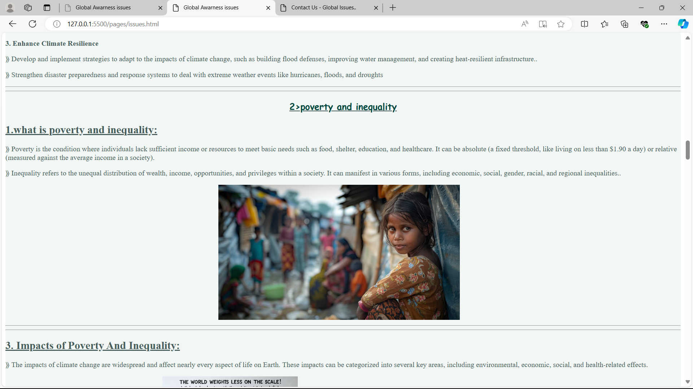
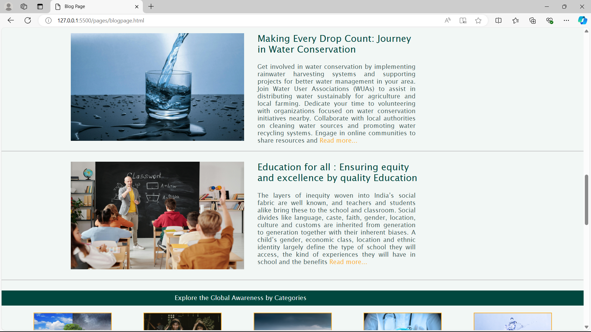

# Global Issues Awareness Platform 
## Project Overview 
Welcome to Global Issues Awareness Platform
Global Issues Awareness Platform is an website which showcasing a Global Awareness Issue Platform is typically a digital platform or online hub designed to raise awareness, educate, and mobilize people around pressing global issues. These platforms often cover topics such as climate change, human rights, public health, social justice, and more. 

## Objectives
Plan to achieve by the end of project.

- The primary goal is to educate people about global issues, providing accurate and up-to-date information.
- Encouraging active participation through discussions, campaigns, and events.
- Facilitating advocacy efforts by connecting users with organizations, petitions, and policy proposals.
- Amplify underrepresented voices and stories from around the world, bringing attention to critical issues that may not receive widespread coverage.
- Highlight and advocate for sustainable practices and policies that address the root causes of global issues.
- Track the effectiveness of awareness campaigns, educational efforts, and advocacy initiatives.
- Facilitate connections between individuals, communities, and organizations working towards common goals.
---
[**Home Page** Screenshot]

---

[**About Page** Screenshot]

---

[**Issues page** Screenshot]

---
[**Get Involved page** Screenshot]

---
[**Resources Page** Screenshot]

---
[**Blog Page** Screenshot]

---
[**Contact page** Screenshot]

---

[ Visit to website ]

( https://icp9-0-html-css-group-project-2-azure.vercel.app/ )
                   ( https://quiet-boba-1a2443.netlify.app/ )

## How  to Contribute

We welcome contributions from the community to help us expand  and improve this project. If you waould like to contribute, follow the steps:

1. Fork the repository to your GitHub account.
2. Make your changes, add new content, or fix any exiting issues.
3. Open a new pull request in this repository.

## Contributors

<table>
  <tr>
    <td align="center"><a href="https://github.com/VaishnaviKolse"> <b>Vaishnavi Kolse</b></a></td>
    <td align="center"><a href="https://github.com/Amruta1006"> <b>Amruta Maskar</b></a></td>
    <td align="center"><a href="https://github.com/manthansharadbire"> <b>Manthan Bire</b></a></td>
    <td align="center"><a href="https://github.com/SakSak-del"> <b>Sakshi Gadhe</b></a></td>
    <td align="center"><a href="https://github.com/Kadam9552"> <b>Aishwarya Kadam</b></a></td>
    <td align="center"><a href="https://github.com/katware02"> <b>Ankita Katware</b></a></td>
    
</tr>
</table>

